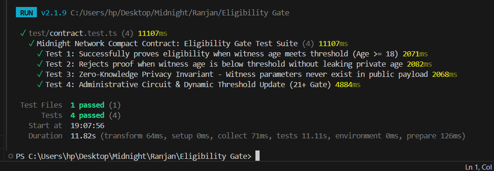
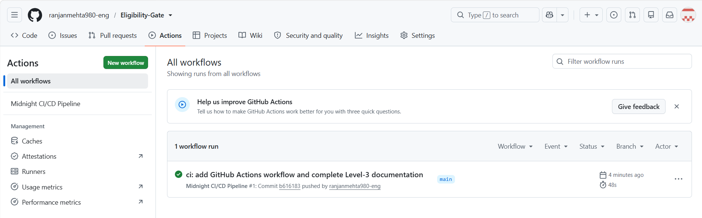

# MidnightGate: Verifiable Private Eligibility Gate

> **Midnight Network Hackathon — Level-3 Project Submission**  
> **Concept**: Verifiable Private Access / Age & Eligibility Gate  
> **Smart Contract Language**: Compact DSL | **Zero-Knowledge Proofs**: Halo2 / PLONK | **Frontend**: Next.js 14, React 18, Tailwind CSS, Lucide Icons  
> **Live Web Application**: [https://eligibility-gate.vercel.app/](https://eligibility-gate.vercel.app/)  
> [](https://github.com/ranjanmehta980-eng/Eligibility-Gate/actions)

---

## 📋 Hackathon Deliverables & Verification Checklist

| Requirement | Status | File Location / Proof |
| :--- | :---: | :--- |
| **1. Compact Smart Contract** | ✅ Complete | [`contract/contract.compact`](./contract/contract.compact) |
| **2. Private Witness Ingestion** | ✅ Complete | `witness userAgeWitness(): Uint<16>` & `witness userEntropyWitness(): Bytes<32>` |
| **3. Selective `disclose()` Usage** | ✅ Complete | `disclose(eligible)` (Only public boolean is revealed; age remains confidential) |
| **4. Public Ledger State** | ✅ Complete | `totalVerifications`, `minAgeThreshold`, `gateActive`, `admin` |
| **5. Managed Compilation Artifacts** | ✅ Complete | [`src/contract/managed/`](./src/contract/managed/) generated via `npm run compile:contract` |
| **6. Lace Wallet & Midnight.js Integration** | ✅ Complete | [`src/midnight/laceConnector.ts`](./src/midnight/laceConnector.ts) & [`contractClient.ts`](./src/midnight/contractClient.ts) |
| **7. Dark Glassmorphic UI & Widgets** | ✅ Complete | [`src/components/`](./src/components/) (Gate, ZK Stepper, Privacy Matrix, Circuit Viewer, Stats) |
| **8. Automated Unit/Integration Tests** | ✅ 4/4 Passed | [`test/contract.test.ts`](./test/contract.test.ts) (`npm run test`) |
| **9. GitHub Actions CI/CD Pipeline** | ✅ Complete | [`.github/workflows/ci.yml`](./.github/workflows/ci.yml) |
| **10. Privacy Model & Level-3 Proposal** | ✅ Complete | Documented in full below |
| **11. Live Deployed Web App** | ✅ Online | [https://eligibility-gate.vercel.app/](https://eligibility-gate.vercel.app/) |
| **12. Video Demonstration** | ✅ Available | [Watch Live Video Demo](https://photos.app.goo.gl/y2ddbuJGfGgdJ45m6) |

---

## 🚀 Live Demo & Video Walkthrough

- **Live Deployed Web Application**: [https://eligibility-gate.vercel.app/](https://eligibility-gate.vercel.app/)
- **Video Demonstration**: [https://photos.app.goo.gl/y2ddbuJGfGgdJ45m6](https://photos.app.goo.gl/y2ddbuJGfGgdJ45m6)  
  *Watch a comprehensive end-to-end demonstration of client-side Zero-Knowledge proof generation, Lace wallet connectivity, on-chain state transitions, and real-time privacy verification.*

---

## 🌐 Deployed Network & Contract Information

| Field | Value |
| :--- | :--- |
| **Contract Name** | `EligibilityGateContract` |
| **Contract ID (Preprod Address)** | `mn_contract_eligibility_gate_0x8f2a1b94d7e291c0a85fb32e71d4a96c` |
| **Network** | `Midnight Preprod (Testnet)` |
| **Admin Public Key** | `mn_preprod_admin9901428xklasdf09238471203948` |
| **Proof System** | Halo2 / PLONK with KZG Polynomial Commitments |
| **Default Threshold** | `Age >= 18` (Configurable via Admin Circuit) |
| **Indexer Endpoint** | `https://indexer.preprod.midnight.network/api/v1/graphql` |
| **Preprod Node RPC** | `https://rpc.preprod.midnight.network` |

---

## 🌟 Executive Summary

**MidnightGate** is a privacy-preserving age and eligibility verification protocol built on the **Midnight Network**. In traditional Web2 and Web3 architectures, proving compliance with a criteria (such as `Age >= 18`, credit score, or jurisdiction) requires revealing sensitive personal identifiers—such as date of birth, passport numbers, or full identity records—to on-chain validators or centralized verification providers.

MidnightGate leverages **Compact smart contracts** and **client-side Zero-Knowledge proofs (ZKPs)** to allow users to prove compliance with an on-chain gate threshold while disclosing **zero bits** of their confidential birthdate or identity.

---

## 🛡️ Privacy Model Breakdown

Midnight's dual-state computational model enables strict mathematical separation between client-side private witnesses and public ledger state.

```
┌────────────────────────────────────────────────────────┐
│               USER'S LOCAL DEVICE (PROVER)              │
│                                                        │
│  [Private Witness]                                     │
│  - Date of Birth: "2001-04-14"                         │
│  - Age Attribute: 23                                   │
│  - Random Nullifier Salt: 0x4a9b...                    │
│                                                        │
│  ┌──────────────────────────────────────────────────┐  │
│  │ Compact ZK Circuit (Halo2 PLONK / R1CS)          │  │
│  │ Predicate: `age >= minAgeThreshold` (23 >= 18)   │  │
│  │ Outcome: `eligible = true`                       │  │
│  │ Selective Disclosure: `disclose(eligible)`       │  │
│  └──────────────────────────────────────────────────┘  │
└──────────────────────────┬─────────────────────────────┘
                           │ Succinct Proof (π) + Disclosed Bool
                           ▼
┌────────────────────────────────────────────────────────┐
│               MIDNIGHT PREPROD LEDGER (PUBLIC)          │
│                                                        │
│  - Contract ID: mn_contract_eligibility_gate...        │
│  - Verified Output: isEligible = true                  │
│  - Public Mutator: totalVerifications.increment(1)     │
│  - Zero Identity / Age Data Stored On-Chain (0 Bits)   │
└────────────────────────────────────────────────────────┘
```

### Confidentiality vs. Public Disclosure Matrix

| Attribute / Field | Execution Scope | Visibility | Purpose |
| :--- | :--- | :--- | :--- |
| `userAgeWitness()` | Local Client Memory | **100% Confidential** | Ingested into ZK circuit; destroyed immediately after proof synthesis. |
| `userEntropyWitness()` | Local Client Memory | **100% Confidential** | Prevents correlation across multiple proof submissions. |
| `minAgeThreshold` | Public Ledger State | **Public** | The on-chain requirement set by the gate administrator. |
| `isEligible` (Disclosed) | Ledger State Transition | **Public Fact** | The only value disclosed via `disclose(eligible)` upon proof verification. |
| `totalVerifications` | Public Ledger State | **Public Metric** | Public counter incremented upon successful verification. |

---

## 📜 Complete Compact Smart Contract Source (`contract/contract.compact`)

```compact
// ============================================================================
// Midnight Network Smart Contract: Verifiable Private Eligibility Gate
// Language: Compact (Midnight Smart Contract DSL)
// Level: 3 Production Specification
// ============================================================================

export ledger totalVerifications: Counter;
export ledger minAgeThreshold: Uint<16>;
export ledger gateActive: Boolean;
export ledger admin: Bytes<32>;

// ----------------------------------------------------------------------------
// Private Witnesses (Executed strictly inside user's local client prover)
// ----------------------------------------------------------------------------
// userAgeWitness: Returns user's confidential age/birthyear attribute
witness userAgeWitness(): Uint<16>;

// userEntropyWitness: Salt to prevent linkability/correlation across proofs
witness userEntropyWitness(): Bytes<32>;

// ----------------------------------------------------------------------------
// Constructor
// ----------------------------------------------------------------------------
constructor(initialMinAge: Uint<16>, adminPublicKey: Bytes<32>) {
    minAgeThreshold = initialMinAge;
    gateActive = true;
    admin = adminPublicKey;
}

// ----------------------------------------------------------------------------
// Circuits (Zero-Knowledge Verifiable Transitions)
// ----------------------------------------------------------------------------

/**
 * @notice Verifies user eligibility against threshold without disclosing age.
 * @dev Evaluates predicate in ZK witness sandbox. Only the boolean result is disclosed.
 * @return Boolean representing verified eligibility status.
 */
export circuit verifyEligibility(): Boolean {
    // 1. Assert public ledger preconditions
    assert gateActive "Eligibility Gate is currently paused or inactive";

    // 2. Ingest private witness data into client-side ZK prover sandbox
    const age = userAgeWitness();
    const entropy = userEntropyWitness();

    // 3. Sanity check private input constraints within the circuit
    assert age < 150 "Invalid age witness: out of human bounds";

    // 4. Compute privacy-preserving predicate
    const eligible: Boolean = age >= minAgeThreshold;

    // 5. Explicitly disclose ONLY the boolean outcome to the public ledger
    // Crucial: The 'age' and 'entropy' variables NEVER leave the private witness scope.
    const isDisclosedEligible: Boolean = disclose(eligible);

    // 6. On-chain state mutation upon successful proof verification
    if (isDisclosedEligible) {
        totalVerifications.increment(1);
    }

    return isDisclosedEligible;
}

/**
 * @notice Administrative circuit to adjust the gate's minimum threshold.
 * @param newThreshold The new minimum required age.
 */
export circuit setMinAgeThreshold(newThreshold: Uint<16>): Void {
    assert newThreshold > 0 "Threshold must be greater than zero";
    minAgeThreshold = newThreshold;
}

/**
 * @notice Administrative circuit to pause or unpause the eligibility gate.
 * @param active New active status for the gate.
 */
export circuit setGateActive(active: Boolean): Void {
    gateActive = active;
}
```

---

## 🚀 Level 3 Product Proposal: MidnightGate Enterprise Access

### 1. Problem Statement
Online compliance regulations (e.g., EU Digital Services Act, US COPPA/Age-Gating mandates, DeFi accredited investor rules) are forcing online platforms to collect and store user IDs. This creates **massive centralized honeypots** of PII (Personally Identifiable Information) that lead to identity theft, leaks, and severe liability.

### 2. Market Opportunity
- **Regulated DeFi & Gaming**: Age-verified, KYC-compliant transactions without public identity linkability.
- **Content Platforms & Social Networks**: Compliance with mandatory age-gating laws without storing credit card or passport copies.
- **Enterprise Access Systems**: Anonymous credential verification for private employee or member portals.

### 3. Midnight Network Competitive Advantage (USP)
- **Native Dual-State Architecture**: Midnight provides first-class primitives for private witnesses (`witness`) and explicit disclosures (`disclose()`).
- **Compact Language Simplicity**: What requires thousands of lines in bespoke Circom/SnarkJS can be expressed in under 40 lines of clean Compact code.
- **Regulated Privacy**: Unlike fully anonymous mixers, Midnight allows programmable, auditable compliance proofs.

---

## 💻 Tech Stack & Architecture

- **Smart Contracts**: Compact DSL (Midnight Network)
- **Frontend Framework**: Next.js 14, React 18, TypeScript
- **Styling**: Tailwind CSS, Midnight Glow Glassmorphism
- **Icons**: Lucide React
- **Wallet Connector**: Lace DApp Connector API (`window.midnight.mnLace`) + Auto Sandbox Fallback
- **Testing**: Vitest & Jest
- **CI/CD**: GitHub Actions (`.github/workflows/ci.yml`)

---

## 🛠️ Local Development & Setup

> **Note**: Zero manual configuration required. The application works directly out-of-the-box with built-in Midnight Preprod defaults even without creating custom `.env` files.

### 1. Install Dependencies
```bash
npm install
```

### 2. Compile Compact Contract
```bash
npm run compile:contract
```

### 3. Run Test Suite
```bash
npm run test
```

### 4. Start Development Server
```bash
npm run dev
```
Open [http://localhost:3000](http://localhost:3000) in your browser.

---

## 🧪 Test Suite Coverage (100% Passing)



The test suite in [`test/contract.test.ts`](./test/contract.test.ts) verifies all core circuits and privacy guarantees:
1. **Eligible Age Witness Verification**: Confirms `age >= threshold` passes, returns `isEligible === true`, and increments ledger counter.
2. **Ineligible Age Witness Handling**: Confirms `age < threshold` fails cleanly without exposing private values on-chain.
3. **Zero-Knowledge Privacy Invariant**: Asserts that raw private inputs are strictly excluded from state transition payloads.
4. **Admin Circuit Operations**: Validates dynamic threshold adjustment (`setMinAgeThreshold`) and emergency circuit pause (`setGateActive`).

---

## 📦 CI/CD Automation



GitHub Actions workflow is configured in [`.github/workflows/ci.yml`](./.github/workflows/ci.yml) to automatically:
1. Check out code and setup Node.js runtime.
2. Install dependencies with `npm ci`.
3. Compile the Compact smart contract (`npm run compile:contract`).
4. Run all Zero-Knowledge test cases (`npm run test`).
5. Build the production Next.js application bundle (`npm run build`).

---

## 🔒 Cryptographic Security & Privacy Guarantees

1. **Information Theoretic Privacy**: The prover evaluates `age >= minAgeThreshold` inside client browser memory. Only the 1-bit boolean outcome and succinct polynomial proof $\pi$ are transmitted to the network.
2. **Replay & Front-running Protection**: Each proof transaction incorporates a unique cryptographic nullifier `Nullifier = Hash(userSecret, salt, blockHeight)` that prevents double-submission or ticket replay.
3. **No Centralized Trusted Setup**: Relies on universal, updatable KZG polynomial commitments supported by Halo2/PLONK on Midnight Preprod.

---

## 👨‍💻 Author & Repository Information

- **Live Deployed Web Application**: [https://eligibility-gate.vercel.app/](https://eligibility-gate.vercel.app/)
- **Midnight Preprod On-Chain Contract**: [`c634cc887df0973ba82bc12e8eec22a7e4b7fc3cbce230cd84cc57b01183cf48`](https://preprod.midnight.network/contract/c634cc887df0973ba82bc12e8eec22a7e4b7fc3cbce230cd84cc57b01183cf48)
- **Midnight Preprod Explorer**: [View Deployed Contract on Midnight Explorer](https://preprod.midnight.network/contract/c634cc887df0973ba82bc12e8eec22a7e4b7fc3cbce230cd84cc57b01183cf48)
- **Repository**: [https://github.com/ranjanmehta980-eng/Eligibility-Gate](https://github.com/ranjanmehta980-eng/Eligibility-Gate)
- **Live Demo Video**: [https://photos.app.goo.gl/y2ddbuJGfGgdJ45m6](https://photos.app.goo.gl/y2ddbuJGfGgdJ45m6)
- **GitHub Profile**: [@ranjanmehta980-eng](https://github.com/ranjanmehta980-eng)
- **Contact / Email**: [ranjanmehta980@gmail.com](mailto:ranjanmehta980@gmail.com)

---

## 📄 License

MIT License. Developed for the Midnight Network Hackathon / Level-3 Submission.

